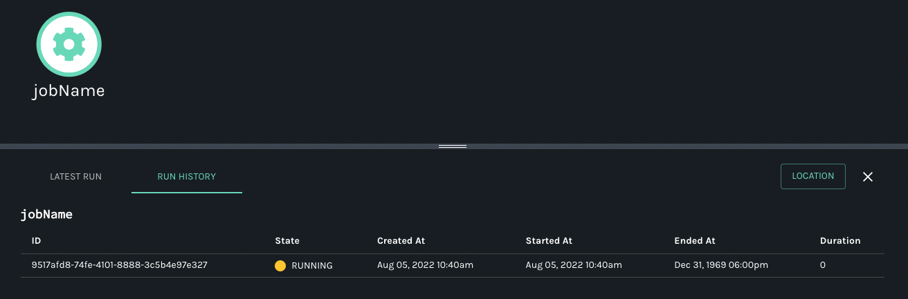
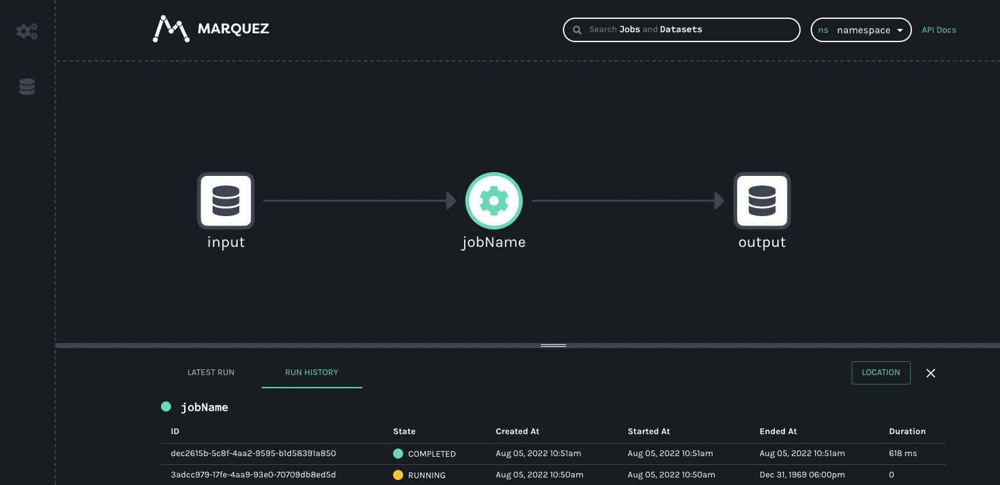

# Java

The Java client is a SDK for Java programming language that users can use to generate and emit OpenLineage events to OpenLineage backends.

## Overview

The OpenLineage Java client enables the creation of lineage metadata events with Java code. The core data structures currently offered by the client are the `RunEvent`, `RunState`, `Run`, `Job`, `Dataset`, and `Transport` classes, along with various `Facets` that can come under run, job, and dataset.

There are various transport classes that the library provivdes that carries the lineage events into various target endpoints (e.g. HTTP).

You can also use the Java client to create your own custom integrations.

## Installation

Java client is provided as library that can either be imported into your Java project using Maven or Gradle.

Maven:

```xml
<dependency>
    <groupId>io.openlineage</groupId>
    <artifactId>openlineage-java</artifactId>
    <version>0.12.0</version>
</dependency>
```

or Gradle:

```groovy
implementation 'io.openlineage:openlineage-java:0.12.0'
```

For more information on the available versions of the `openliange-java`, please refer to the [maven repository](https://search.maven.org/artifact/io.openlineage/openlineage-java).

## Configuration

Use the following options to configure the client:

* An `openlineage.yml` in the user's current working directory
* An `openlineage.yml` under `.openlineage/` in the user's home directory (ex: `~/.openlineage/openlineage.yml`)
* Environment variables

> **Note:** By default, the client will give you sane defaults, but you can easily override them.
>

### Environment Variables

The list of available environment varaibles can be found [here](../development/developing#environment-variables).

`YAML`

```yaml
transport:
  type: <type>
  # ... transport specific configuration
```

Here is an example of using HTTP transport for your client:

```yaml
transport:
  type: http
  url: http://localhost:5000
```

> **Note:** For a full list of supported transports, see [`transports`](https://github.com/OpenLineage/OpenLineage/tree/main/client/java/src/main/java/io/openlineage/client/transports).

### Transports

The `Transport` abstraction defines an `emit()` method for   `OpenLineage.RunEvent`. There are three built-in transports: `ConsoleTransport`, `HttpTransport`, and `KafkaTransport`.

#### [`ConsoleTransport`](https://github.com/OpenLineage/OpenLineage/tree/main/client/java/src/main/java/io/openlineage/client/transports/ConsoleTransport.java) 

in YAML:
```yaml
transport:
  type: CONSOLE
```

You can also specify the ConsoleTransport when building a new client instance.

```java
OpenLineageClient client = OpenLineageClient.builder()
  .transport(
    new ConsoleTransport()
  .build();
```

#### [`HttpTransport`](https://github.com/OpenLineage/OpenLineage/tree/main/client/java/src/main/java/io/openlineage/client/transports/HttpTransport.java)

in YAML:
```yaml
transport:
  type: HTTP
  url: http://localhost:5000
  auth:
    type: api_key
    api_key: f38d2189-c603-4b46-bdea-e573a3b5a7d5
```

You can override the default configuration of the `HttpTransport` by specifying the URL and API key when
creating a new client:

```java
OpenLineageClient client = OpenLineageClient.builder()
  .transport(
    HttpTransport.builder()
      .uri("http://localhost:5000")
      .apiKey("f38d2189-c603-4b46-bdea-e573a3b5a7d5")
      .build())
  .build();
```

To configure the client with query params appended on each HTTP request, use:

```java
Map<String, String> queryParamsToAppend = Map.of(
  "param0","value0",
  "param1", "value1"
);

// Connect to http://localhost:5000
OpenLineageClient client = OpenLineageClient.builder()
  .transport(
    HttpTransport.builder()
      .uri("http://localhost:5000", queryParamsToAppend)
      .apiKey("f38d2189-c603-4b46-bdea-e573a3b5a7d5")
      .build())
  .build();

// Define a simple OpenLineage START or COMPLETE event
OpenLineage.RunEvent startOrCompleteRun = ...

// Emit OpenLineage event to http://localhost:5000/api/v1/lineage?param0=value0&param1=value1
client.emit(startOrCompleteRun);
```

Alternatively, use the following environment variables to configure the `HttpTransport`:

* `OPENLINEAGE_URL`: the URL for the HTTP transport (default: `http://localhost:8080`)
* `OPENLINEAGE_API_KEY`: the API key to be set on each HTTP request

Not everything will be supported while using this method.

#### [`KafkaTransport`](https://github.com/OpenLineage/OpenLineage/tree/main/client/java/src/main/java/io/openlineage/client/transports/KafkaTransport.java)

in YAML:
```yaml
transport:
  type: Kafka
  topicName: openlineage.events
  # Kafka properties (see: http://kafka.apache.org/0100/documentation.html#producerconfigs)
  properties:
    bootstrap.servers: localhost:9092,another.host:9092
    acks: all
    retries: 3
    key.serializer: org.apache.kafka.common.serialization.StringSerializer
    value.serializer: org.apache.kafka.common.serialization.StringSerializer
```

KafkaTransport depends on you to provide artifact `org.apache.kafka:kafka-clients:3.1.0` or compatible on your classpath.

### Error Handling via Transport

```java
// Connect to http://localhost:5000
OpenLineageClient client = OpenLineageClient.builder()
  .transport(
    HttpTransport.builder()
      .uri("http://localhost:5000")
      .apiKey("f38d2189-c603-4b46-bdea-e573a3b5a7d5")
      .build())
  .registerErrorHandler(new EmitErrorHandler() {
    @Override
    public void handleError(Throwable throwable) {
      // Handle emit error here
    }
  }).build();
```

### Defining Your Own Transport

```java
OpenLineageClient client = OpenLineageClient.builder()
  .transport(
    new MyTransport() {
      @Override
      public void emit(OpenLineage.RunEvent runEvent) {
        // Add emit logic here
      }
    }).build();
```

## Usage

### 1. Simple OpenLineage Client Test for Console Transport
First, let's explore how we can create OpenLineage client instance, but not using any actual transport to emit the data yet, except only to our `Console.` This would be a good exercise to run tests and check the data payloads.

```java
    OpenLineageClient client = OpenLineageClient.builder()
        .transport(new ConsoleTransport()).build();
```

Also, we will then get a sample payload to produce a `RunEvent`:

```java
    // create one start event for testing
    RunEvent event = buildEvent(EventType.START);
```

Lastly, we will emit this event using the client that we instantiated\:

```java
    // emit the event
    client.emit(event);
```

Here is the full source code of the test client application:

```java
package ol.test;

import io.openlineage.client.OpenLineage;
import io.openlineage.client.OpenLineageClient;
import io.openlineage.client.OpenLineage.RunEvent;
import io.openlineage.client.OpenLineage.InputDataset;
import io.openlineage.client.OpenLineage.Job;
import io.openlineage.client.OpenLineage.JobFacets;
import io.openlineage.client.OpenLineage.OutputDataset;
import io.openlineage.client.OpenLineage.Run;
import io.openlineage.client.OpenLineage.RunFacets;
import io.openlineage.client.OpenLineage.RunEvent.EventType;
import io.openlineage.client.transports.ConsoleTransport;
import java.net.URI;
import java.time.ZoneId;
import java.time.ZonedDateTime;
import java.util.Arrays;
import java.util.List;
import java.util.UUID;

/**
 * My first openlinage client code
 */
public class OpenLineageClientTest
{
    public static void main( String[] args )
    {
        try {
            OpenLineageClient client = OpenLineageClient.builder()
            .transport(new ConsoleTransport()).build();

            // create one start event for testing
            RunEvent event = buildEvent(EventType.START);

            // emit the event
            client.emit(event);

        } catch (Exception e) {
            e.printStackTrace();
        }

    }

    // sample code to build event
    public static RunEvent buildEvent(EventType eventType) {
        ZonedDateTime now = ZonedDateTime.now(ZoneId.of("UTC"));
        URI producer = URI.create("producer");
        OpenLineage ol = new OpenLineage(producer);
        UUID runId = UUID.randomUUID();

        // run facets
        RunFacets runFacets =
        ol.newRunFacetsBuilder()
            .nominalTime(
                ol.newNominalTimeRunFacetBuilder()
                    .nominalStartTime(now)
                    .nominalEndTime(now)
                    .build())
            .build();

        // a run is composed of run id, and run facets
        Run run = ol.newRunBuilder().runId(runId).facets(runFacets).build();

        // job facets
        JobFacets jobFacets = ol.newJobFacetsBuilder().build();

        // job
        String name = "jobName";
        String namespace = "namespace";
        Job job = ol.newJobBuilder().namespace(namespace).name(name).facets(jobFacets).build();

        // input dataset
        List<InputDataset> inputs =
        Arrays.asList(
            ol.newInputDatasetBuilder()
                .namespace("ins")
                .name("input")
                .facets(
                    ol.newDatasetFacetsBuilder()
                        .version(ol.newDatasetVersionDatasetFacet("input-version"))
                        .build())
                .inputFacets(
                    ol.newInputDatasetInputFacetsBuilder()
                        .dataQualityMetrics(
                            ol.newDataQualityMetricsInputDatasetFacetBuilder()
                                .rowCount(10L)
                                .bytes(20L)
                                .columnMetrics(
                                    ol.newDataQualityMetricsInputDatasetFacetColumnMetricsBuilder()
                                        .put(
                                            "mycol",
                                            ol.newDataQualityMetricsInputDatasetFacetColumnMetricsAdditionalBuilder()
                                                .count(10D)
                                                .distinctCount(10L)
                                                .max(30D)
                                                .min(5D)
                                                .nullCount(1L)
                                                .sum(3000D)
                                                .quantiles(
                                                    ol.newDataQualityMetricsInputDatasetFacetColumnMetricsAdditionalQuantilesBuilder()
                                                        .put("25", 52D)
                                                        .build())
                                                .build())
                                        .build())
                                .build())
                        .build())
                .build());
        // output dataset
        List<OutputDataset> outputs =
            Arrays.asList(
                ol.newOutputDatasetBuilder()
                    .namespace("ons")
                    .name("output")
                    .facets(
                        ol.newDatasetFacetsBuilder()
                            .version(ol.newDatasetVersionDatasetFacet("output-version"))
                            .build())
                    .outputFacets(
                        ol.newOutputDatasetOutputFacetsBuilder()
                            .outputStatistics(ol.newOutputStatisticsOutputDatasetFacet(10L, 20L))
                            .build())
                    .build());

        // run state udpate which encapsulates all - with START event in this case
        RunEvent runStateUpdate =
        ol.newRunEventBuilder()
            .eventType(OpenLineage.RunEvent.EventType.START)
            .eventTime(now)
            .run(run)
            .job(job)
            .inputs(inputs)
            .outputs(outputs)
            .build();

        return runStateUpdate;
    }
}
```

The result of running this will result in the following output from your Java application:

```
[main] INFO io.openlineage.client.transports.ConsoleTransport - {"eventType":"START","eventTime":"2022-08-05T15:11:24.858414Z","run":{"runId":"bb46bbc4-fb1a-495a-ad3b-8d837f566749","facets":{"nominalTime":{"_producer":"producer","_schemaURL":"https://openlineage.io/spec/facets/1-0-0/NominalTimeRunFacet.json#/$defs/NominalTimeRunFacet","nominalStartTime":"2022-08-05T15:11:24.858414Z","nominalEndTime":"2022-08-05T15:11:24.858414Z"}}},"job":{"namespace":"namespace","name":"jobName","facets":{}},"inputs":[{"namespace":"ins","name":"input","facets":{"version":{"_producer":"producer","_schemaURL":"https://openlineage.io/spec/facets/1-0-0/DatasetVersionDatasetFacet.json#/$defs/DatasetVersionDatasetFacet","datasetVersion":"input-version"}},"inputFacets":{"dataQualityMetrics":{"_producer":"producer","_schemaURL":"https://openlineage.io/spec/facets/1-0-0/DataQualityMetricsInputDatasetFacet.json#/$defs/DataQualityMetricsInputDatasetFacet","rowCount":10,"bytes":20,"columnMetrics":{"mycol":{"nullCount":1,"distinctCount":10,"sum":3000.0,"count":10.0,"min":5.0,"max":30.0,"quantiles":{"25":52.0}}}}}}],"outputs":[{"namespace":"ons","name":"output","facets":{"version":{"_producer":"producer","_schemaURL":"https://openlineage.io/spec/facets/1-0-0/DatasetVersionDatasetFacet.json#/$defs/DatasetVersionDatasetFacet","datasetVersion":"output-version"}},"outputFacets":{"outputStatistics":{"_producer":"producer","_schemaURL":"https://openlineage.io/spec/facets/1-0-0/OutputStatisticsOutputDatasetFacet.json#/$defs/OutputStatisticsOutputDatasetFacet","rowCount":10,"size":20}}}],"producer":"producer","schemaURL":"https://openlineage.io/spec/1-0-2/OpenLineage.json#/$defs/RunEvent"}
```

### 2. Simple OpenLineage Client Test for Http Transport

Now, using the same code base, we will change how the client application works by switching the Console transport into `Http Transport` as shown below. This code will now be able to send the OpenLineage events into a compatible backends such as [Marquez](https://marquezproject.ai/). 

Before making this change and running it, make sure you have an instance of Marquez running on your local environment. Setting up and running Marquez can be found [here](https://marquezproject.github.io/marquez/quickstart.html).

```java
OpenLineageClient client = OpenLineageClient.builder()
    .transport(
        HttpTransport.builder()
        .uri("http://localhost:5000")
        .build())
    .build();
```
If we ran the same application, you will now see the event data not emitted in the output console, but rather via the HTTP transport to the marquez backend that was running.



Notice that the Status of this job run will be in `RUNNING` state, as it will be in that state until it receives an `end` event that will close off its gaps. That is how the OpenLineage events would work.

Now, let's change the previous example to have lineage event doing a complete cycle of `START` -> `COMPLETE`:

```java
package ol.test;

import io.openlineage.client.OpenLineage;
import io.openlineage.client.OpenLineageClient;
import io.openlineage.client.OpenLineage.RunEvent;
import io.openlineage.client.OpenLineage.InputDataset;
import io.openlineage.client.OpenLineage.Job;
import io.openlineage.client.OpenLineage.JobFacets;
import io.openlineage.client.OpenLineage.OutputDataset;
import io.openlineage.client.OpenLineage.Run;
import io.openlineage.client.OpenLineage.RunFacets;
import io.openlineage.client.OpenLineage.RunEvent.EventType;
import io.openlineage.client.transports.HttpTransport;

import java.net.URI;
import java.time.ZoneId;
import java.time.ZonedDateTime;
import java.util.Arrays;
import java.util.List;
import java.util.UUID;

/**
 * My first openlinage client code
 */
public class OpenLineageClientTest
{
    public static void main( String[] args )
    {
        try {

            OpenLineageClient client = OpenLineageClient.builder()
                .transport(
                    HttpTransport.builder()
                    .uri("http://localhost:5000")
                    .build())
                .build();

            // create one start event for testing
            RunEvent event = buildEvent(EventType.START, null);

            // emit the event
            client.emit(event);

            // another event to COMPLETE the run
            event = buildEvent(EventType.COMPLETE, event.getRun().getRunId());

            // emit the second COMPLETE event
            client.emit(event);

        } catch (Exception e) {
            e.printStackTrace();
        }
    }

    // sample code to build event
    public static RunEvent buildEvent(EventType eventType, UUID runId) {
        ZonedDateTime now = ZonedDateTime.now(ZoneId.of("UTC"));
        URI producer = URI.create("producer");
        OpenLineage ol = new OpenLineage(producer);

        if (runId == null) {
            runId = UUID.randomUUID();
        }

        // run facets
        RunFacets runFacets =
        ol.newRunFacetsBuilder()
            .nominalTime(
                ol.newNominalTimeRunFacetBuilder()
                    .nominalStartTime(now)
                    .nominalEndTime(now)
                    .build())
            .build();

        // a run is composed of run id, and run facets
        Run run = ol.newRunBuilder().runId(runId).facets(runFacets).build();

        // job facets
        JobFacets jobFacets = ol.newJobFacetsBuilder().build();

        // job
        String name = "jobName";
        String namespace = "namespace";
        Job job = ol.newJobBuilder().namespace(namespace).name(name).facets(jobFacets).build();

        // input dataset
        List<InputDataset> inputs =
        Arrays.asList(
            ol.newInputDatasetBuilder()
                .namespace("ins")
                .name("input")
                .facets(
                    ol.newDatasetFacetsBuilder()
                        .version(ol.newDatasetVersionDatasetFacet("input-version"))
                        .build())
                .inputFacets(
                    ol.newInputDatasetInputFacetsBuilder()
                        .dataQualityMetrics(
                            ol.newDataQualityMetricsInputDatasetFacetBuilder()
                                .rowCount(10L)
                                .bytes(20L)
                                .columnMetrics(
                                    ol.newDataQualityMetricsInputDatasetFacetColumnMetricsBuilder()
                                        .put(
                                            "mycol",
                                            ol.newDataQualityMetricsInputDatasetFacetColumnMetricsAdditionalBuilder()
                                                .count(10D)
                                                .distinctCount(10L)
                                                .max(30D)
                                                .min(5D)
                                                .nullCount(1L)
                                                .sum(3000D)
                                                .quantiles(
                                                    ol.newDataQualityMetricsInputDatasetFacetColumnMetricsAdditionalQuantilesBuilder()
                                                        .put("25", 52D)
                                                        .build())
                                                .build())
                                        .build())
                                .build())
                        .build())
                .build());
        // output dataset
        List<OutputDataset> outputs =
            Arrays.asList(
                ol.newOutputDatasetBuilder()
                    .namespace("ons")
                    .name("output")
                    .facets(
                        ol.newDatasetFacetsBuilder()
                            .version(ol.newDatasetVersionDatasetFacet("output-version"))
                            .build())
                    .outputFacets(
                        ol.newOutputDatasetOutputFacetsBuilder()
                            .outputStatistics(ol.newOutputStatisticsOutputDatasetFacet(10L, 20L))
                            .build())
                    .build());

        // run state udpate which encapsulates all - with START event in this case
        RunEvent runStateUpdate =
        ol.newRunEventBuilder()
            .eventType(eventType)
            .eventTime(now)
            .run(run)
            .job(job)
            .inputs(inputs)
            .outputs(outputs)
            .build();

        return runStateUpdate;
    }
}
```
Now, when you run this application, the Marquez would have an output that would looke like this:



