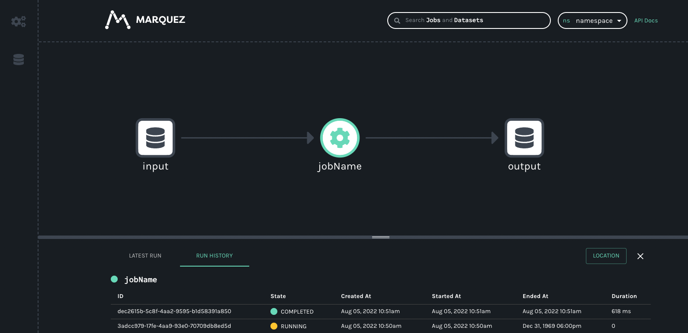

```java
// Use openlineage.yml
OpenLineageClient client = Clients.newClient();

// Define a simple OpenLineage START or COMPLETE event
OpenLineage.RunEvent startOrCompleteRun = ...

// Emit OpenLineage event
client.emit(startOrCompleteRun);
```

### 1. Simple OpenLineage Client Test for Console Transport
First, let's explore how we can create OpenLineage client instance, but not using any actual transport to emit the data yet, except only to our `Console.` This would be a good exercise to run tests and check the data payloads.

```java
    OpenLineageClient client = OpenLineageClient.builder()
        .transport(new ConsoleTransport()).build();
```

Also, we will then get a sample payload to produce a `RunEvent`:

```java
    // create one start event for testing
    RunEvent event = buildEvent(EventType.START);
```

Lastly, we will emit this event using the client that we instantiated\:

```java
    // emit the event
    client.emit(event);
```

Here is the full source code of the test client application:

```java
package ol.test;

import io.openlineage.client.OpenLineage;
import io.openlineage.client.OpenLineageClient;
import io.openlineage.client.OpenLineage.RunEvent;
import io.openlineage.client.OpenLineage.InputDataset;
import io.openlineage.client.OpenLineage.Job;
import io.openlineage.client.OpenLineage.JobFacets;
import io.openlineage.client.OpenLineage.OutputDataset;
import io.openlineage.client.OpenLineage.Run;
import io.openlineage.client.OpenLineage.RunFacets;
import io.openlineage.client.OpenLineage.RunEvent.EventType;
import io.openlineage.client.transports.ConsoleTransport;
import java.net.URI;
import java.time.ZoneId;
import java.time.ZonedDateTime;
import java.util.Arrays;
import java.util.List;
import java.util.UUID;

/**
 * My first openlinage client code
 */
public class OpenLineageClientTest
{
    public static void main( String[] args )
    {
        try {
            OpenLineageClient client = OpenLineageClient.builder()
            .transport(new ConsoleTransport()).build();

            // create one start event for testing
            RunEvent event = buildEvent(EventType.START);

            // emit the event
            client.emit(event);

        } catch (Exception e) {
            e.printStackTrace();
        }

    }

    // sample code to build event
    public static RunEvent buildEvent(EventType eventType) {
        ZonedDateTime now = ZonedDateTime.now(ZoneId.of("UTC"));
        URI producer = URI.create("producer");
        OpenLineage ol = new OpenLineage(producer);
        UUID runId = UUID.randomUUID();

        // run facets
        RunFacets runFacets =
        ol.newRunFacetsBuilder()
            .nominalTime(
                ol.newNominalTimeRunFacetBuilder()
                    .nominalStartTime(now)
                    .nominalEndTime(now)
                    .build())
            .build();

        // a run is composed of run id, and run facets
        Run run = ol.newRunBuilder().runId(runId).facets(runFacets).build();

        // job facets
        JobFacets jobFacets = ol.newJobFacetsBuilder().build();

        // job
        String name = "jobName";
        String namespace = "namespace";
        Job job = ol.newJobBuilder().namespace(namespace).name(name).facets(jobFacets).build();

        // input dataset
        List<InputDataset> inputs =
        Arrays.asList(
            ol.newInputDatasetBuilder()
                .namespace("ins")
                .name("input")
                .facets(
                    ol.newDatasetFacetsBuilder()
                        .version(ol.newDatasetVersionDatasetFacet("input-version"))
                        .build())
                .inputFacets(
                    ol.newInputDatasetInputFacetsBuilder()
                        .dataQualityMetrics(
                            ol.newDataQualityMetricsInputDatasetFacetBuilder()
                                .rowCount(10L)
                                .bytes(20L)
                                .columnMetrics(
                                    ol.newDataQualityMetricsInputDatasetFacetColumnMetricsBuilder()
                                        .put(
                                            "mycol",
                                            ol.newDataQualityMetricsInputDatasetFacetColumnMetricsAdditionalBuilder()
                                                .count(10D)
                                                .distinctCount(10L)
                                                .max(30D)
                                                .min(5D)
                                                .nullCount(1L)
                                                .sum(3000D)
                                                .quantiles(
                                                    ol.newDataQualityMetricsInputDatasetFacetColumnMetricsAdditionalQuantilesBuilder()
                                                        .put("25", 52D)
                                                        .build())
                                                .build())
                                        .build())
                                .build())
                        .build())
                .build());
        // output dataset
        List<OutputDataset> outputs =
            Arrays.asList(
                ol.newOutputDatasetBuilder()
                    .namespace("ons")
                    .name("output")
                    .facets(
                        ol.newDatasetFacetsBuilder()
                            .version(ol.newDatasetVersionDatasetFacet("output-version"))
                            .build())
                    .outputFacets(
                        ol.newOutputDatasetOutputFacetsBuilder()
                            .outputStatistics(ol.newOutputStatisticsOutputDatasetFacet(10L, 20L))
                            .build())
                    .build());

        // run state udpate which encapsulates all - with START event in this case
        RunEvent runStateUpdate =
        ol.newRunEventBuilder()
            .eventType(OpenLineage.RunEvent.EventType.START)
            .eventTime(now)
            .run(run)
            .job(job)
            .inputs(inputs)
            .outputs(outputs)
            .build();

        return runStateUpdate;
    }
}
```

The result of running this will result in the following output from your Java application:

```
[main] INFO io.openlineage.client.transports.ConsoleTransport - {"eventType":"START","eventTime":"2022-08-05T15:11:24.858414Z","run":{"runId":"bb46bbc4-fb1a-495a-ad3b-8d837f566749","facets":{"nominalTime":{"_producer":"producer","_schemaURL":"https://openlineage.io/spec/facets/1-0-0/NominalTimeRunFacet.json#/$defs/NominalTimeRunFacet","nominalStartTime":"2022-08-05T15:11:24.858414Z","nominalEndTime":"2022-08-05T15:11:24.858414Z"}}},"job":{"namespace":"namespace","name":"jobName","facets":{}},"inputs":[{"namespace":"ins","name":"input","facets":{"version":{"_producer":"producer","_schemaURL":"https://openlineage.io/spec/facets/1-0-0/DatasetVersionDatasetFacet.json#/$defs/DatasetVersionDatasetFacet","datasetVersion":"input-version"}},"inputFacets":{"dataQualityMetrics":{"_producer":"producer","_schemaURL":"https://openlineage.io/spec/facets/1-0-0/DataQualityMetricsInputDatasetFacet.json#/$defs/DataQualityMetricsInputDatasetFacet","rowCount":10,"bytes":20,"columnMetrics":{"mycol":{"nullCount":1,"distinctCount":10,"sum":3000.0,"count":10.0,"min":5.0,"max":30.0,"quantiles":{"25":52.0}}}}}}],"outputs":[{"namespace":"ons","name":"output","facets":{"version":{"_producer":"producer","_schemaURL":"https://openlineage.io/spec/facets/1-0-0/DatasetVersionDatasetFacet.json#/$defs/DatasetVersionDatasetFacet","datasetVersion":"output-version"}},"outputFacets":{"outputStatistics":{"_producer":"producer","_schemaURL":"https://openlineage.io/spec/facets/1-0-0/OutputStatisticsOutputDatasetFacet.json#/$defs/OutputStatisticsOutputDatasetFacet","rowCount":10,"size":20}}}],"producer":"producer","schemaURL":"https://openlineage.io/spec/1-0-2/OpenLineage.json#/$defs/RunEvent"}
```

### 2. Simple OpenLineage Client Test for Http Transport

Now, using the same code base, we will change how the client application works by switching the Console transport into `Http Transport` as shown below. This code will now be able to send the OpenLineage events into a compatible backends such as [Marquez](https://marquezproject.ai/).

Before making this change and running it, make sure you have an instance of Marquez running on your local environment. Setting up and running Marquez can be found [here](https://marquezproject.github.io/marquez/quickstart.html).

```java
OpenLineageClient client = OpenLineageClient.builder()
    .transport(
        HttpTransport.builder()
        .uri("http://localhost:5000")
        .build())
    .build();
```
If we ran the same application, you will now see the event data not emitted in the output console, but rather via the HTTP transport to the marquez backend that was running.


Notice that the Status of this job run will be in `RUNNING` state, as it will be in that state until it receives an `end` event that will close off its gaps. That is how the OpenLineage events would work.

Now, let's change the previous example to have lineage event doing a complete cycle of `START` -> `COMPLETE`:

```java
package ol.test;

import io.openlineage.client.OpenLineage;
import io.openlineage.client.OpenLineageClient;
import io.openlineage.client.OpenLineage.RunEvent;
import io.openlineage.client.OpenLineage.InputDataset;
import io.openlineage.client.OpenLineage.Job;
import io.openlineage.client.OpenLineage.JobFacets;
import io.openlineage.client.OpenLineage.OutputDataset;
import io.openlineage.client.OpenLineage.Run;
import io.openlineage.client.OpenLineage.RunFacets;
import io.openlineage.client.OpenLineage.RunEvent.EventType;
import io.openlineage.client.transports.HttpTransport;

import java.net.URI;
import java.time.ZoneId;
import java.time.ZonedDateTime;
import java.util.Arrays;
import java.util.List;
import java.util.UUID;

/**
 * My first openlinage client code
 */
public class OpenLineageClientTest
{
    public static void main( String[] args )
    {
        try {

            OpenLineageClient client = OpenLineageClient.builder()
                .transport(
                    HttpTransport.builder()
                    .uri("http://localhost:5000")
                    .build())
                .build();

            // create one start event for testing
            RunEvent event = buildEvent(EventType.START, null);

            // emit the event
            client.emit(event);

            // another event to COMPLETE the run
            event = buildEvent(EventType.COMPLETE, event.getRun().getRunId());

            // emit the second COMPLETE event
            client.emit(event);

        } catch (Exception e) {
            e.printStackTrace();
        }
    }

    // sample code to build event
    public static RunEvent buildEvent(EventType eventType, UUID runId) {
        ZonedDateTime now = ZonedDateTime.now(ZoneId.of("UTC"));
        URI producer = URI.create("producer");
        OpenLineage ol = new OpenLineage(producer);

        if (runId == null) {
            runId = UUID.randomUUID();
        }

        // run facets
        RunFacets runFacets =
        ol.newRunFacetsBuilder()
            .nominalTime(
                ol.newNominalTimeRunFacetBuilder()
                    .nominalStartTime(now)
                    .nominalEndTime(now)
                    .build())
            .build();

        // a run is composed of run id, and run facets
        Run run = ol.newRunBuilder().runId(runId).facets(runFacets).build();

        // job facets
        JobFacets jobFacets = ol.newJobFacetsBuilder().build();

        // job
        String name = "jobName";
        String namespace = "namespace";
        Job job = ol.newJobBuilder().namespace(namespace).name(name).facets(jobFacets).build();

        // input dataset
        List<InputDataset> inputs =
        Arrays.asList(
            ol.newInputDatasetBuilder()
                .namespace("ins")
                .name("input")
                .facets(
                    ol.newDatasetFacetsBuilder()
                        .version(ol.newDatasetVersionDatasetFacet("input-version"))
                        .build())
                .inputFacets(
                    ol.newInputDatasetInputFacetsBuilder()
                        .dataQualityMetrics(
                            ol.newDataQualityMetricsInputDatasetFacetBuilder()
                                .rowCount(10L)
                                .bytes(20L)
                                .columnMetrics(
                                    ol.newDataQualityMetricsInputDatasetFacetColumnMetricsBuilder()
                                        .put(
                                            "mycol",
                                            ol.newDataQualityMetricsInputDatasetFacetColumnMetricsAdditionalBuilder()
                                                .count(10D)
                                                .distinctCount(10L)
                                                .max(30D)
                                                .min(5D)
                                                .nullCount(1L)
                                                .sum(3000D)
                                                .quantiles(
                                                    ol.newDataQualityMetricsInputDatasetFacetColumnMetricsAdditionalQuantilesBuilder()
                                                        .put("25", 52D)
                                                        .build())
                                                .build())
                                        .build())
                                .build())
                        .build())
                .build());
        // output dataset
        List<OutputDataset> outputs =
            Arrays.asList(
                ol.newOutputDatasetBuilder()
                    .namespace("ons")
                    .name("output")
                    .facets(
                        ol.newDatasetFacetsBuilder()
                            .version(ol.newDatasetVersionDatasetFacet("output-version"))
                            .build())
                    .outputFacets(
                        ol.newOutputDatasetOutputFacetsBuilder()
                            .outputStatistics(ol.newOutputStatisticsOutputDatasetFacet(10L, 20L))
                            .build())
                    .build());

        // run state udpate which encapsulates all - with START event in this case
        RunEvent runStateUpdate =
        ol.newRunEventBuilder()
            .eventType(eventType)
            .eventTime(now)
            .run(run)
            .job(job)
            .inputs(inputs)
            .outputs(outputs)
            .build();

        return runStateUpdate;
    }
}
```
Now, when you run this application, the Marquez would have an output that would looke like this:



