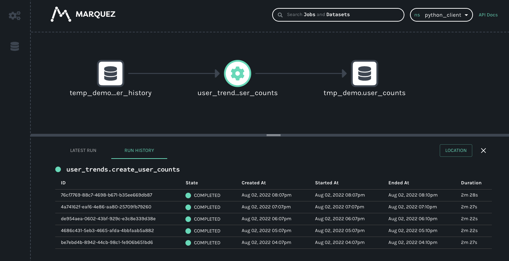

# Python

## Overview

The Python client is the basis of existing OpenLineage integrations such as Airflow and dbt.

The client enables the creation of lineage metadata events with Python code. The core data structures currently offered by the client are the `RunEvent`, `RunState`, `Run`, `Job`, `Dataset`, and `Transport` classes. These either configure or collect data for the emission of lineage events.

You can use the client to create your own custom integrations.

## Installation

Download the package using `pip` with 
```
pip install openlineage-python
```

To install the package from source, use 
```
python setup.py install
```

## Configuration

We recommend configuring the client with an `openlineage.yml` file that tells the client how to connect to an OpenLineage backend.

You can make this file available to the client three ways:

1. Set an environment variable to a file path: `OPENLINEAGE_CONFIG=path/to/openlineage.yml`.
2. Put the file in the working directory.
3. Put the file in `$HOME/.openlineage`.

In `openlineage.yml`, use a standard transport interface to specify the transport type (`http`, `console`, `kafka`, `file`, or custom) and authorization parameters:

```
transport:
  type: "http"
  url: "https://backend:5000"
  auth:
    type: "api_key"
    api_key: "f048521b-dfe8-47cd-9c65-0cb07d57591e"
```

The type property (required) is a fully qualified class name that can be imported.

### Environment Variables

The list of available environment varaibles can be found [here](../development/developing#environment-variables).

### Built-in Transport Types

##### HTTP
- type - string (required)
- url - string (required)
- endpoint - string specifying the endpoint to which events are sent. Default: api/v1/lineage (optional)
- timeout - float specifying a timeout value when sending an event. Default: 5 seconds. (optional)
- verify - boolean specifying whether the client should verify TLS certificates from the backend. Default: true. (optional)
- auth - dictionary specifying authentication options. Requires the type property. (optional)
  - type - string specifying the "api_key" or the fully qualified class name of your TokenProvider. (required if `auth` is provided)
  - api_key - string setting the Authentication HTTP header as the Bearer. (required if `api_key` is set)

Example:
```
transport:
  type: http
  url: https://backend:5000
  endpoint: events/receive
  auth:
    type: api_key
    api_key: f048521b-dfe8-47cd-9c65-0cb07d57591e
```

##### Console 
- type - string (required)

Example:
```
transport:
  type: console
```

##### Kafka

Kafka transport requires `confluent-kafka` package to be additionally installed.
It can be installed also by specifying kafka client extension: `pip install openlineage-python[kafka]` 

- type - string (required)
- config - string containing a Kafka producer config (required)
- topic - string specifying the topic (required)
- flush - boolean specifying whether Kafka should flush after each event. Default: true. (optional)

There's a caveat for using `KafkaTransport` with Airflow integration. In this integration, a Kafka producer needs to be created 
for each OpenLineage event. 
It happens due to the Airflow execution and plugin model, which requires us to send messages from worker processes.
These are created dynamically for each task execution.

Example:
```
transport:
  type: kafka
  config:
    bootstrap.servers: mybroker
    acks: all
    retries: 3
  topic: my_topic
  flush: true
```

#### File

- log_file_path - string specifying the path of the file (if append is true, a file path is expected, otherwise a file prefix is expected).  (required)
- append - boolean . If set to True, each event will be appended to a single file (log_file_path); otherwise, all events will be written separately in distinct files suffixed by a timestring. Default: false. (optional)

Example:
```
transport:
  type: file
  log_file_path: ol_events_
  append: false
```

### Custom Transport Type

To implement a custom transport, follow the instructions in [`transport.py`](https://github.com/OpenLineage/OpenLineage/blob/main/client/python/openlineage/client/transport/transport.py).

## Getting Started

To try out the client, follow the steps below to install and explore OpenLineage, Marquez (the reference implementation of OpenLineage), and the client itself. Then, the instructions will show you how to use these tools to add a run event and datasets to an existing namespace.

### Prerequisites
- Docker 17.05+
- Docker Compose 1.29.1+
- Git (preinstalled on most versions of MacOS; verify your version with `git version`)
- 4 GB of available memory (the minimum for Docker — more is strongly recommended)

### Install OpenLineage and Marquez

Clone the Marquez Github repository:
```
git clone https://github.com/MarquezProject/marquez.git
```

### Install the Python client
```
pip install openlineage-python
```

### Start Docker and Marquez
Start Docker Desktop
Run Marquez with preloaded data:
```
cd marquez
./docker/up.sh --seed
```

Marquez should be up and running at `http://localhost:3000`.

Take a moment to explore Marquez to get a sense of how metadata is displayed in the UI. Namespaces – the global contexts for runs and datasets – can be found in the top right corner, and icons for jobs and runs can be found in a tray along the left side.

Next, configure OpenLineage and add a script to your project that will generate a new job and new datasets within an existing namespace (here we’re using the `food_delivery` namespace that got passed to Marquez with the `–seed` argument we used earlier).

Create a directory for your script:
```
..
mkdir python_scripts && cd python_scripts
```

In the python_scripts directory, create a Python script (we used the name `generate_events.py` for ours) and an `openlineage.yml` file.

In `openlineage.yml`, define a transport type and URL to tell OpenLineage where and how to send metadata:

```
transport:
  type: http
  url: http://localhost:5000
```

In `generate_events.py`, import the Python client and the methods needed to create a job and datasets. Also required (to create a run): the `datetime` and `uuid` packages:

```
from openlineage.client.run import RunEvent, RunState, Run, Job, Dataset
from openlineage.client import OpenLineageClient
from datetime import datetime
from uuid import uuid4
```

Then, in the same file, initialize the Python client:
```
client = OpenLineageClient.from_environment()
```

It is also possible to specify parameters such as URL for client to connect to, without using environment variables or `openlineage.yaml` file, by directly setting it up when instantiating OpenLineageClient:

```
client = OpenLineageClient(url="http://localhost:5000")
```

> For more details about options to setup OpenLineageClient such as API tokens or HTTP transport settings, please refer to the following [example](https://github.com/OpenLineage/OpenLineage/blob/main/client/python/tests/test_http.py)


Specify the producer of the new lineage metadata with a string:
```
producer = “OpenLineage.io/website/blog”
```

Now you can create some basic dataset objects. These require a namespace and name:
```
inventory = Dataset(namespace=“food_delivery”, name=“public.inventory”)
menus = Dataset(namespace=“food_delivery”, name=“public.menus_1”)
orders = Dataset(namespace=“food_delivery”, name=“public.orders_1”)
```

You can also create a job object (we’ve borrowed this one from the existing `food_delivery` namespace):
```
job = Job(namespace=“food_delivery”, name=“example.order_data”)
```

To create a run object you’ll need to specify a unique ID:
```
run = Run(str(uuid4()))
```

a START run event:
```
client.emit(
	RunEvent(
		RunState.START,
		datetime.now().isoformat(),
		run, job, producer
	)
)
```

and, finally, a COMPLETE run event:
```
client.emit(
	RunEvent(
		RunState.COMPLETE,
		datetime.now().isoformat(),
		run, job, producer,
		inputs=[inventory],
		outputs=[menus, orders],
	)
)
```

Now you have a complete script for creating datasets and a run event! Execute it in the terminal to send the metadata to Marquez:
```
python3 generate_scripts.py
```

Marquez will update itself automatically, so the new job and datasets should now be visible in the UI. Clicking on the jobs icon (the icon with the three interlocking gears), will make the `example.order_data` job appear in the list of jobs:


When you click on the job, you will see a new map displaying the job, input and outputs we created with our script:


## Full Example Source Code

```python
#!/usr/bin/env python3
from openlineage.client.run import (
    RunEvent,
    RunState,
    Run,
    Job,
    Dataset,
    OutputDataset,
    InputDataset,
)
from openlineage.client.client import OpenLineageClient, OpenLineageClientOptions
from openlineage.client.facet import (
    SqlJobFacet,
    SchemaDatasetFacet,
    SchemaField,
    OutputStatisticsOutputDatasetFacet,
    SourceCodeLocationJobFacet,
    NominalTimeRunFacet,
    DataQualityMetricsInputDatasetFacet,
    ColumnMetric,
)
import uuid
from datetime import datetime, timezone, timedelta
import time
from random import random

PRODUCER = f"https://github.com/openlineage-user"
namespace = "python_client"
dag_name = "user_trends"

url = "http://mymarquez.host:5000"
api_key = "1234567890ckcu028rzu5l"

client = OpenLineageClient(
    url=url,
	# optional api key in case marquez requires it. When running marquez in
	# your local environment, you usually do not need this.
    options=OpenLineageClientOptions(api_key=api_key),
)

# generates job facet
def job(job_name, sql, location):
    facets = {"sql": SqlJobFacet(sql)}
    if location != None:
        facets.update(
            {"sourceCodeLocation": SourceCodeLocationJobFacet("git", location)}
        )
    return Job(namespace=namespace, name=job_name, facets=facets)


# geneartes run racet
def run(run_id, hour):
    return Run(
        runId=run_id,
        facets={
            "nominalTime": NominalTimeRunFacet(
                nominalStartTime=f"2022-04-14T{twoDigits(hour)}:12:00Z"
            )
        },
    )


# generates dataset
def dataset(name, schema=None, ns=namespace):
    if schema == None:
        facets = {}
    else:
        facets = {"schema": schema}
    return Dataset(namespace, name, facets)


# generates output dataset
def outputDataset(dataset, stats):
    output_facets = {"stats": stats, "outputStatistics": stats}
    return OutputDataset(dataset.namespace, dataset.name, dataset.facets, output_facets)


# generates input dataset
def inputDataset(dataset, dq):
    input_facets = {
        "dataQuality": dq,
    }
    return InputDataset(dataset.namespace, dataset.name, dataset.facets, input_facets)


def twoDigits(n):
    if n < 10:
        result = f"0{n}"
    elif n < 100:
        result = f"{n}"
    else:
        raise f"error: {n}"
    return result


now = datetime.now(timezone.utc)


# generates run Event
def runEvents(job_name, sql, inputs, outputs, hour, min, location, duration):
    run_id = str(uuid.uuid4())
    myjob = job(job_name, sql, location)
    myrun = run(run_id, hour)
    st = now + timedelta(hours=hour, minutes=min, seconds=20 + round(random() * 10))
    end = st + timedelta(minutes=duration, seconds=20 + round(random() * 10))
    started_at = st.isoformat()
    ended_at = end.isoformat()
    return (
        RunEvent(
            eventType=RunState.START,
            eventTime=started_at,
            run=myrun,
            job=myjob,
            producer=PRODUCER,
            inputs=inputs,
            outputs=outputs,
        ),
        RunEvent(
            eventType=RunState.COMPLETE,
            eventTime=ended_at,
            run=myrun,
            job=myjob,
            producer=PRODUCER,
            inputs=inputs,
            outputs=outputs,
        ),
    )


# add run event to the events list
def addRunEvents(
    events, job_name, sql, inputs, outputs, hour, minutes, location=None, duration=2
):
    (start, complete) = runEvents(
        job_name, sql, inputs, outputs, hour, minutes, location, duration
    )
    events.append(start)
    events.append(complete)


events = []

# create dataset data
for i in range(0, 5):

    user_counts = dataset("tmp_demo.user_counts")
    user_history = dataset(
        "temp_demo.user_history",
        SchemaDatasetFacet(
            fields=[
                SchemaField(name="id", type="BIGINT", description="the user id"),
                SchemaField(
                    name="email_domain", type="VARCHAR", description="the user id"
                ),
                SchemaField(name="status", type="BIGINT", description="the user id"),
                SchemaField(
                    name="created_at",
                    type="DATETIME",
                    description="date and time of creation of the user",
                ),
                SchemaField(
                    name="updated_at",
                    type="DATETIME",
                    description="the last time this row was updated",
                ),
                SchemaField(
                    name="fetch_time_utc",
                    type="DATETIME",
                    description="the time the data was fetched",
                ),
                SchemaField(
                    name="load_filename",
                    type="VARCHAR",
                    description="the original file this data was ingested from",
                ),
                SchemaField(
                    name="load_filerow",
                    type="INT",
                    description="the row number in the original file",
                ),
                SchemaField(
                    name="load_timestamp",
                    type="DATETIME",
                    description="the time the data was ingested",
                ),
            ]
        ),
        "snowflake://",
    )

    create_user_counts_sql = """CREATE OR REPLACE TABLE TMP_DEMO.USER_COUNTS AS (
			SELECT DATE_TRUNC(DAY, created_at) date, COUNT(id) as user_count
			FROM TMP_DEMO.USER_HISTORY
			GROUP BY date
			)"""

    # location of the source code
    location = "https://github.com/some/airflow/dags/example/user_trends.py"

    # run simulating Airflow DAG with snowflake operator
    addRunEvents(
        events,
        dag_name + ".create_user_counts",
        create_user_counts_sql,
        [user_history],
        [user_counts],
        i,
        11,
        location,
    )


for event in events:
    from openlineage.client.serde import Serde

    print(event)
    print(Serde.to_json(event))
    # time.sleep(1)
    client.emit(event)
```
The resulting lineage events received by Marquez would look like this.


