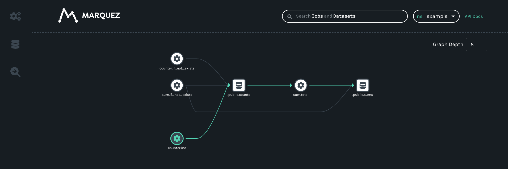
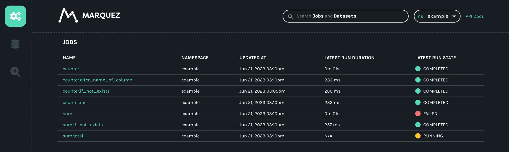
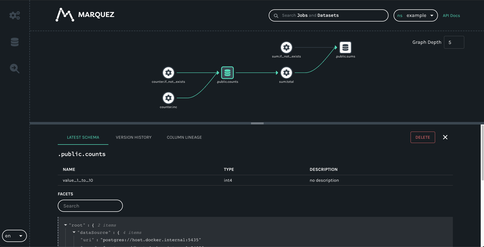
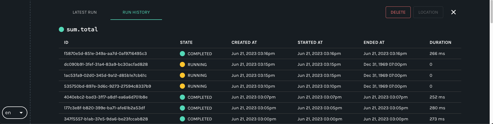

# Getting Started with Airflow and OpenLineage+Marquez

In this example, we'll walk you through how to enable Airflow DAGs to send lineage metadata to [Marquez](https://marquezproject.ai/) using OpenLineage. 

### You’ll Learn How To:

* configure Airflow to send OpenLineage events to Marquez
* write OpenLineage-enabled DAGs
* troubleshoot a failing DAG using Marquez

## Prerequisites

Before you begin, make sure you have installed:

* [Docker 17.05](https://docs.docker.com/install)+
* [Astro CLI](https://docs.astronomer.io/astro/cli/overview)
* [PostgreSQL](https://www.postgresql.org/download/)

> **Note:** We recommend that you have allocated at least **2 CPUs** and **8 GB** of memory to Docker.

## Step 1: Setup

First, if you haven't already, clone the Marquez repository and change into the [`marquez`](https://github.com/MarquezProject/marquez/) directory:

```bash
git clone https://github.com/MarquezProject/marquez && cd marquez
```

Run the following command to start Marquez with its API configured to use ports 9000 and 9001:

```
./docker/up.sh -a 9000 -m 9001
```

For more details about configuring and starting Marquez, see the quickstart in the [Marquez README](https://github.com/MarquezProject/marquez#quickstart).

## Step 2: Configure Your Astro Project

Use the Astro CLI to create and run an Airflow project locally that will integrate with Marquez.

1. Create a new Astro project alongside `marquez`:

    ```sh
    $ ..
    $ mkdir astro-marquez-tutorial && cd astro-marquez-tutorial
    $ astro dev init
    ```

2. Add the following environment variables below to your Astro project's `.env` file:

    ```bash
    OPENLINEAGE_URL=http://host.docker.internal:9000
    OPENLINEAGE_NAMESPACE=example
    AIRFLOW__LINEAGE__BACKEND=openlineage.lineage_backend.OpenLineageBackend
    ```

    These variables allow Airflow to connect with the OpenLineage API and send your lineage metadata to Marquez.

3. Marquez also uses Postgres, so you will need to have Airflow use a different port than the default 5432, which is already allocated to Airflow. Run the following command to use port 5435 for Postgres:

    ```sh
    astro config set postgres.port 5435
    ```

## Step 3: Write Airflow DAGs using OpenLineage

In this step, you will create two new Airflow DAGs that perform simple tasks. The `counter` DAG adds 1 to a column every minute, while the `sum` DAG calculates a sum every five minutes. This will result in a simple pipeline containing two jobs and two datasets.

First, change into the `dags` directory where your DAGs will be located:

```bash
$ cd dags
```

### Step 3.1: Create a `counter` DAG

Under `dags/`, create a file named `counter.py` and add the following code:

```python
from airflow import DAG
from airflow.decorators import task
from airflow.providers.postgres.operators.postgres import PostgresOperator
from airflow.utils.dates import days_ago

default_args = {
    'owner': 'datascience',
    'depends_on_past': False,
    'start_date': days_ago(1),
    'email_on_failure': False,
    'email_on_retry': False,
    'email': ['datascience@example.com']
}

with DAG(
    'counter',
    schedule_interval='*/1 * * * *',
    catchup=False,
    is_paused_upon_creation=False,
    max_active_runs=1,
    default_args=default_args,
    description='DAG that generates a new count value equal to 1.'
) as dag:

    query1 = PostgresOperator(
        task_id='if_not_exists',
        postgres_conn_id='example_db',
        sql='''
        CREATE TABLE IF NOT EXISTS counts (
            value INTEGER
        );'''
    )

    query2 = PostgresOperator(
        task_id='inc',
        postgres_conn_id='example_db',
        sql='''
        INSERT INTO counts (value)
            VALUES (1) 
        '''
    )

query1 >> query2
```

### Step 3.2: Create a `sum` DAG

In `dags/`, create a file named `sum.py` and add the following code:

```python
from airflow import DAG
from airflow.providers.postgres.operators.postgres import PostgresOperator
from airflow.utils.dates import days_ago

default_args = {
    'owner': 'datascience',
    'depends_on_past': False,
    'start_date': days_ago(1),
    'email_on_failure': False,
    'email_on_retry': False,
    'email': ['datascience@example.com']
}

with DAG(
    'sum',
    schedule_interval='*/5 * * * *',
    catchup=False,
    is_paused_upon_creation=False,
    max_active_runs=1,
    default_args=default_args,
    description='DAG that sums the total of generated count values.'
) as dag:

    query1 = PostgresOperator(
        task_id='if_not_exists',
        postgres_conn_id='example_db',
        sql='''
        CREATE TABLE IF NOT EXISTS sums (
        value INTEGER
        );'''
    )

    query2 = PostgresOperator(
        task_id='total',
        postgres_conn_id='example_db',
        sql='''
        INSERT INTO sums (value)
            SELECT SUM(value) FROM counts;
        '''
    )

query1 >> query2
```

## Step 4: Configure Your Database

To show the lineage metadata that can result from Airflow DAG runs, your DAGs will process data in Postgres. To run this example in your local environment, complete the following steps:

1. Using `psql`, create a local Postgres database in the same container as the Airflow metastore:

    ```bash
    psql -h localhost -p 5435 -U postgres
    # enter password `postgres` when prompted
    create database lineagetutorial;
    \c lineagetutorial;
    ```

    If you already have a Postgres database or are using a different type of database you can skip this step. Note that this database should be separate from the Airflow and Marquez metastores.

## Step 5: Configure Your Airflow Connection

The connection you configure will connect to the Postgres database you created in [Step 3](#step-3-configure-your-database).

1. In the Airflow UI, go to **Admin** -> **Connections**.

2. Create a new connection named `example_db` and choose the `postgres` connection type. Enter the following information:

    - **Host:** `host.docker.internal`
    - **Login:** `postgres`
    - **Password:** `postgres`
    - **Port:** `5435`

    If you are working with a database other than local Postgres, you may need to provide different information to the connection.

## Step 6: Start Airflow with Marquez

Now that you have your DAGs defined and you can run the example! To start Astro, run:

```bash
$ astro dev start
```

**The above command will:**

* start Airflow
* start Postgres

To view the Airflow UI and verify it's running, open [http://localhost:8080](http://localhost:8080). Then, log in using the username and password `admin` / `admin`. You can also browse to [http://localhost:3000](http://localhost:3000) to view the Marquez UI.

## Step 7: View Collected Metadata

To ensure that Airflow is executing `counter` and `sum`, navigate to the DAGs tab in Airflow and verify that they are both enabled and are in a _running_ state:


To view DAG metadata collected by Marquez from Airflow, browse to the Marquez UI by visiting [http://localhost:3000](http://localhost:3000). Then, use the _search_ bar in the upper right-side of the page and search for the `counter.inc` job. To view lineage metadata for `counter.inc`, click on the job from the drop-down list:

> **Note:** If the `counter.inc` job is not in the drop-down list, check to see if Airflow has successfully executed the DAG.

<p align="center">
  
</p>

If you take a quick look at the lineage graph for `counter.inc`, you should see `.public.counts` as an output dataset and `sum.total` as a downstream job!



## Step 5: Troubleshoot a Failing DAG with Marquez

In this step, let's quickly walk through a simple troubleshooting scenario where the DAG `sum` begins to fail as the result of an upstream schema change for table `counts`.

> **Tip:** It's helpful to apply the same code changes outlined below to your Airflow DAGs defined in **Step 3**.

Let's say team `A` owns the DAG `counter`. Team `A` decides to update the `query1` task in `counter` to rename the `values` column in the `counts` table to `value_1_to_10` (without properly communicating the schema change!):

```diff
query1 = PostgresOperator(
-   task_id='if_not_exists',
+   task_id='alter_name_of_column',
    postgres_conn_id='example_db',
    sql='''
-   CREATE TABLE IF NOT EXISTS counts (
-     value INTEGER
-   );''',
+    DO $$
+    BEGIN
+      IF EXISTS(SELECT *
+        FROM information_schema.columns
+        WHERE table_name='counts' and column_name='value')
+      THEN
+        ALTER TABLE "counts" RENAME COLUMN "value" TO "value_1_to_10";
+      END IF;
+    END $$;
+   '''
)
```

```diff
query2 = PostgresOperator(
    task_id='inc',
    postgres_conn_id='example_db',
    sql='''
-    INSERT INTO counts (value)
+    INSERT INTO counts (value_1_to_10)
         VALUES (%(value)s)
    ''',
    parameters={
      'value': random.randint(1, 10)
    }
)
```

Team `B`, unaware of the schema change, owns the DAG `sum` and begins to see DAG run metadata with _failed_ run states:



But, team `B` is not sure what might have caused the DAG failure as no recent code changes have been made to the DAG. So, team `B` decides to check the schema of the input dataset:



Team `B` soon realizes that the schema has changed recently for the `counts` table! To fix the DAG, team `B` updates the `t2` task that calcuates the count total to use the new column name:

```diff
query2 = PostgresOperator(
    task_id='total',
    postgres_conn_id='example_db',
    sql='''
    INSERT INTO sums (value)
-       SELECT SUM(c.value) FROM counts AS c;
+       SELECT SUM(c.value_1_to_10) FROM counts AS c;
    '''
)
```

With the code change, the DAG `sum` begins to run successfully:



_Congrats_! You successfully step through a troubleshooting scenario of a failing DAG using metadata collected with Marquez! You can now add your own DAGs to `dags/` to build more complex data lineage graphs.

## Next Steps

* Review the Marquez [HTTP API](https://marquezproject.github.io/marquez/openapi.html) used to collect Airflow DAG metadata and learn how to build your own integrations using OpenLineage
* Take a look at [`openlineage-spark`](https://openlineage.io/docs/integrations/spark/) integration that can be used with Airflow

## Feedback

What did you think of this example? You can reach out to us on [Slack](http://bit.ly/MarquezSlack) and leave us feedback, or [open a pull request](https://github.com/MarquezProject/marquez/blob/main/CONTRIBUTING.md#submitting-a-pull-request) with your suggestions!