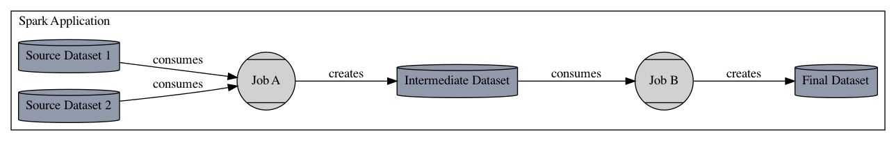

:::info
This integation is known to work with Apache Spark 2.4 and later.
:::

# Apache Spark

Spark jobs typically run on clusters of machines. A single machine hosts the "driver" application,
which constructs a graph of jobs - e.g., reading data from a source, filtering, transforming, and
joining records, and writing results to some sink- and manages execution of those jobs. Spark's
fundamental abstraction is the Resilient Distributed Dataset (RDD), which encapsulates distributed
reads and modifications of records. While RDDs can be used directly, it is far more common to work
with Spark Datasets or Dataframes, which is an API that adds explicit schemas for better performance
and the ability to interact with datasets using SQL. The Dataframe's declarative API enables Spark
to optimize jobs by analyzing and manipulating an abstract query plan prior to execution.

## Collecting Lineage in Spark

Collecting lineage requires hooking into Spark's `ListenerBus` in the driver application and
collecting and analyzing execution events as they happen. Both raw RDD and Dataframe jobs post events
to the listener bus during execution. These events expose the structure of the job, including the
optimized query plan, allowing the Spark integration to analyze the job for datasets consumed and
produced, including attributes about the storage, such as location in GCS or S3, table names in a
relational database or warehouse, such as Redshift or Bigquery, and schemas. In addition to dataset
and job lineage, Spark SQL jobs also report logical plans, which can be compared across job runs to
track important changes in query plans, which may affect the correctness or speed of a job.

A single Spark application may execute multiple jobs. The Spark OpenLineage integration maps one
Spark job to a single OpenLineage Job. The application will be assigned a Run id at startup and each
job that executes will report the application's Run id as its parent job run. Thus, an application
that reads one or more source datasets, writes an intermediate dataset, then transforms that
intermediate dataset and writes a final output dataset will report three jobs- the parent application
job, the initial job that reads the sources and creates the intermediate dataset, and the final job
that consumes the intermediate dataset and produces the final output. As an image:


## How to Use the Integration
Adding OpenLineage metadata collection to existing Spark jobs was designed to be straightforward
and unobtrusive to the application. 


### SparkListener

The `SparkListener` approach is very simple and covers most cases. The listener simply analyzes
events, as they are posted by the SparkContext, and extracts job and dataset metadata that are
exposed by the RDD and Dataframe dependency graphs. Most data sources, such as filesystem sources
(including S3 and GCS), JDBC backends, and warehouses such as Redshift and Bigquery can be analyzed
and reported in this way.

Installation requires adding a following package:

```
<dependency>
    <groupId>io.openlineage</groupId>
    <artifactId>openlineage-spark</artifactId>
    <version>{spark-openlineage-version}</version>
</dependency>
```
or gradle:
```
implementation 'io.openlineage:openlineage-spark:{spark-openlineage-version}'
```

#### spark-submit
The listener can be enabled by adding the following configuration to a `spark-submit` command:

```bash
spark-submit --conf "spark.extraListeners=io.openlineage.spark.agent.OpenLineageSparkListener" \
    --packages "io.openlineage:openlineage-spark:<spark-openlineage-version>" \
    --conf "spark.openlineage.transport.url=http://{openlineage.client.host}/api/v1/namespaces/spark_integration/" \
    --class com.mycompany.MySparkApp my_application.jar
```

The SparkListener reads its configuration from SparkConf parameters. These can be specified on the command line (e.g., `--conf "spark.openlineage.transport.url=http://{openlineage.client.host}/api/v1/namespaces/my_namespace/job/the_job"`) or from the `conf/spark-defaults.conf` file.

#### Spark Config Parameters

The following parameters can be specified:

| Parameter                                           | Definition                                                                                                                                          | Example                             |
-----------------------------------------------------|-----------------------------------------------------------------------------------------------------------------------------------------------------|-------------------------------------
| spark.openlineage.transport.type                    | The transport type used for event emit, default type is `console`                                                                                   | http                                |
| spark.openlineage.namespace                         | The default namespace to be applied for any jobs submitted                                                                                          | MyNamespace                         |
| spark.openlineage.parentJobName                     | The job name to be used for the parent job facet                                                                                                    | ParentJobName                       |
| spark.openlineage.parentRunId                       | The RunId of the parent job that initiated this Spark job                                                                                           | xxxx-xxxx-xxxx-xxxx                 |
| spark.openlineage.appName                           | Custom value overwriting Spark app name in events                                                                                                   | AppName                             |
| spark.openlineage.facets.disabled                   | List of facets to disable, enclosed in `[]` (required from 0.21.x) and separated by `;`, default is `[spark_unknown;]` (currently must contain `;`) | \[spark_unknown;spark.logicalPlan\] |
| spark.openlineage.capturedProperties                | comma separated list of properties to be captured in spark properties facet (default `spark.master`, `spark.app.name`)                              | "spark.example1,spark.example2"     |
| spark.openlineage.dataset.removePath.pattern        | Java regular expression that removes `?<remove>` named group from dataset path. Can be used to last path subdirectories from paths like `s3://my-whatever-path/year=2023/month=04` | `(.*)(?<remove>\/.*\/.*)`     |
| spark.openlineage.jobName.appendDatasetName         | Decides whether output dataset name should be appended to job name. By default `true`.                                                                                             | false                               |
| spark.openlineage.jobName.replaceDotWithUnderscore  | Replaces dots in job name with underscore. Can be used to mimic legacy behaviour on Databricks platform. By default `false`.                                                       | false                               |


##### HTTP

| Parameter                                    | Definition                                                                                                                                  | Example               |
----------------------------------------------|---------------------------------------------------------------------------------------------------------------------------------------------|-----------------------
| spark.openlineage.transport.endpoint          | Path to resource                                                                                                                            | /api/v1/lineage       |
| spark.openlineage.transport.auth.type         | The type of authentication method to use                                                                                                    | api_key               |
| spark.openlineage.transport.auth.apiKey       | An API key to be used when sending events to the OpenLineage server                                                                         | abcdefghijk           |
| spark.openlineage.transport.timeout           | Timeout for sending OpenLineage info in milliseconds                                                                                        | 5000                  |
| spark.openlineage.transport.urlParams.xyz     | A URL parameter (replace xyz) and value to be included in requests to the OpenLineage API server                                            | abcdefghijk           |
| spark.openlineage.transport.url               | The hostname of the OpenLineage API server where events should be reported, it can have other properties embeded                            | http://localhost:5000 |
| spark.openlineage.transport.headers.xyz       | Request headers (replace xyz) and value to be included in requests to the OpenLineage API server                                            | abcdefghijk           |

###### URL

You can supply http parameters using values in url, the parsed `spark.openlineage.*` properties are located in url as follows:

`{transport.url}/{transport.endpoint}/namespaces/{namespace}/jobs/{parentJobName}/runs/{parentRunId}?app_name={appName}&api_key={transport.apiKey}&timeout={transport.timeout}&xxx={transport.urlParams.xxx}`

example:

`http://localhost:5000/api/v1/namespaces/ns_name/jobs/job_name/runs/xxxxxxxx-xxxx-xxxx-xxxx-xxxxxxxxxxxx?app_name=app&api_key=abc&timeout=5000&xxx=xxx`

##### Kinesis
If `spark.openlineage.transport.type` is set to `kinesis`, then the below parameters would be read and used when building KinesisProducer.
Also, KinesisTransport depends on you to provide artifact `com.amazonaws:amazon-kinesis-producer:0.14.0` or compatible on your classpath.

| Parameter                                     | Definition                                                                                                                                                                                   | Example          |
-----------------------------------------------|----------------------------------------------------------------------------------------------------------------------------------------------------------------------------------------------|------------------
| spark.openlineage.transport.streamName        | Required, the streamName of the Kinesis Stream                                                                                                                                               | some-stream-name |
| spark.openlineage.transport.region            | Required, the region of the stream                                                                                                                                                           | us-east-2        |
| spark.openlineage.transport.roleArn           | Optional, the roleArn which is allowed to read/write to Kinesis stream                                                                                                                       | some-role-arn    |
| spark.openlineage.transport.properties.[xxx]  | Optional, the [xxx] is property of [Kinesis allowd properties](https://github.com/awslabs/amazon-kinesis-producer/blob/master/java/amazon-kinesis-producer-sample/default_config.properties) | 1                |

##### Kafka
If `spark.openlineage.transport.type` is set to `kafka`, then the below parameters would be read and used when building KafkaProducer.

| Parameter                                    | Definition                                      | Example    |
----------------------------------------------|-------------------------------------------------|------------
| spark.openlineage.transport.topicName        | Required, name of the topic                     | topic-name |
| spark.openlineage.transport.localServerId    | Required, id of local server                    | xxxxxxxx   |
| spark.openlineage.transport.properties.[xxx] | Optional, the [xxx] is property of Kafka client | 1          |


### Scheduling from Airflow

The same parameters passed to `spark-submit` can be supplied from Airflow and other schedulers. If
using the [openlineage-airflow](../airflow/airflow.md) integration, each task in the DAG has its own Run id
which can be connected to the Spark job run via the `spark.openlineage.parentRunId` parameter. For example,
here is an example of a `DataProcPySparkOperator` that submits a Pyspark application on Dataproc:

```python
t1 = DataProcPySparkOperator(
    task_id=job_name,
    gcp_conn_id='google_cloud_default',
    project_id='project_id',
    cluster_name='cluster-name',
    region='us-west1',
    main='gs://bucket/your-prog.py',
    job_name=job_name,
    dataproc_pyspark_properties={
      "spark.extraListeners": "io.openlineage.spark.agent.OpenLineageSparkListener",
      "spark.jars.packages": "io.openlineage:openlineage-spark:1.0.0+",
      "spark.openlineage.transport.url": f"{openlineage_url}/api/v1/namespaces/{openlineage_namespace}/jobs/dump_orders_to_gcs/runs/{{{{lineage_run_id(run_id, task)}}}}?api_key={api_key}",
      "spark.openlineage.namespace": openlineage_namespace,
      "spark.openlineage.parentJobName": job_name,
      "spark.openlineage.parentRunId": f"{{{{lineage_run_id(run_id, task)}}}}
    },
    dag=dag)
```
