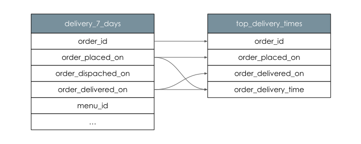

# Column Level Lineage Dataset Facet

Column level lineage provides fine grained information on datasets' dependencies. Not only we know the dependency exist, but we are also able to understand which input columns are used to produce output columns. This allows answering questions like *Which root input columns are used to construct column x?* 

For example, a Job might executes the following query:

```sql
INSERT INTO top_delivery_times (
    order_id,
    order_placed_on,
    order_delivered_on,
    order_delivery_time
)
SELECT
    order_id,
    order_placed_on,
    order_delivered_on,
    DATEDIFF(minute, order_placed_on, order_delivered_on) AS order_delivery_time,
FROM delivery_7_days
ORDER BY order_delivery_time DESC
LIMIT 1;
```

This would establish the following relationships between the `delivery_7_days` and `top_delivery_times` tables:



An OpenLinage run state update that represent this query using column-level lineage facets might look like:

```json
{
    "eventType": "START",
    "eventTime": "2020-02-22T22:42:42.000Z",
    "run": ...,
    "job": ...,
    "inputs": [
        {
          "namespace": "food_delivery",
          "name": "public.delivery_7_days"
        }
    ],
    "outputs": [
        {
            "namespace": "food_delivery",
            "name": "public.top_delivery_times",
            "facets": {
                "columnLineage": {
                    "_producer": "https://github.com/MarquezProject/marquez/blob/main/docker/metadata.json",
                    "_schemaURL": "https://openlineage.io/spec/facets/1-0-1/ColumnLineageDatasetFacet.json",
                    "fields": {
                        "order_id": {
                            "inputFields": [
                                {
                                    "namespace": "food_delivery",
                                    "name": "public.delivery_7_days",
                                    "field": "order_id"
                                }
                            ]
                        },
                        "order_placed_on": {
                            "inputFields": [
                                {
                                    "namespace": "food_delivery",
                                    "name": "public.delivery_7_days",
                                    "field": "order_placed_on"
                                }
                            ]
                        },
                        "order_delivered_on": {
                            "inputFields": [
                                {
                                    "namespace": "food_delivery",
                                    "name": "public.delivery_7_days",
                                    "field": "order_delivered_on"
                                }
                            ]
                        },
                        "order_delivery_time": {
                            "inputFields": [
                                {
                                    "namespace": "food_delivery",
                                    "name": "public.delivery_7_days",
                                    "field": "order_placed_on"
                                },
                                {
                                    "namespace": "food_delivery",
                                    "name": "public.delivery_7_days",
                                    "field": "order_delivered_on"
                                }
                            ]
                        }
                    }
                }
            }
        }
    ],
    ...
}
```

The facet specification can be found [here](https://openlineage.io/spec/facets/1-0-1/ColumnLineageDatasetFacet.json).