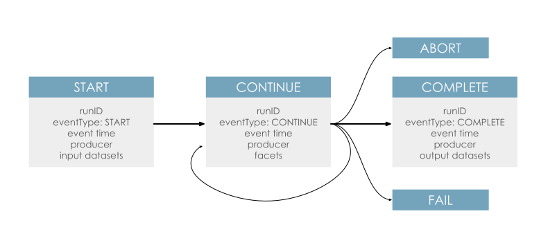

# The Run Cycle

The OpenLineage [object model](object-model.md) is event-based, with each event called a Run State Updates. These updates inform an OpenLineage backend about the ongoing status of a Job.

The OpenLineage Run Cycle has several defined events that correspond to changes in the running statuses of a pipeline task. When a task transitions between these states - e.g. it is initiated, finishes, or fails - a Run State Update is sent that describes that event.

Each Run State Update contains the Run State along with metadata about the Job, its current Run, and its input and output Datasets. It is common to add additional metadata throughout the lifecycle of the run as it becomes available.

## Run States

There are five run states. 
* ``START`` to indicate the beginning of a Job

* ``CONTINUE`` to provide additional information about a running Job

* ``COMPLETE`` to signify that execution of the Job has concluded

* ``ABORT`` to signify that the Job has been stopped abnormally

* ``FAIL`` to signify that the Job has failed

## Typical Scenarios

A batch Job - e.g., an Airflow task or a dbt model - will typically be represented as a `START` event followed by a `COMPLETE` event. Occasionally, an `ABORT` or `FAIL` event will be sent when a job does not complete successfully.

A long-running Job - e.g., a microservice or a stream - will typically be represented by a `START` event followed by a series of `CONTINUE` events that report changes in the run or emit performace metrics. Occasionally, a `COMPLETE`, `ABORT`, or `FAIL` event will followed by a `START` event as the job is reinitiated. 

