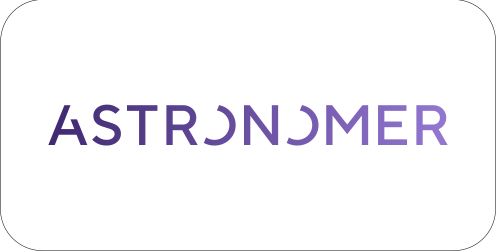
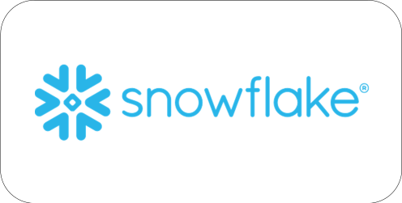
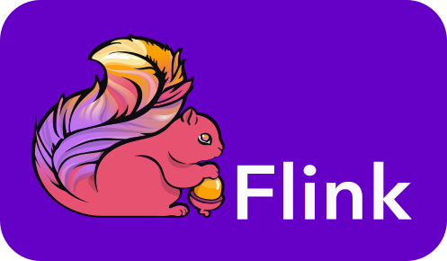

    <h2 className="text-5xl text-color-1">
        Ecosystem
    </h2>

OpenLineage defines the metadata produced by pipelines and consumed by observability tools. A configurable backend allows the user to select a protocol for receiving events. Services using the OpenLineage standard can either consume or produce metadata.

<h2>Consumers</h2>

| 
&nbsp;&nbsp;&nbsp;&nbsp;&nbsp;&nbsp;&nbsp;&nbsp;&nbsp;&nbsp;&nbsp;&nbsp;&nbsp;&nbsp;&nbsp;&nbsp;&nbsp;&nbsp;&nbsp;&nbsp;&nbsp;&nbsp;&nbsp;&nbsp;&nbsp;&nbsp;&nbsp;&nbsp;
 | 
&nbsp;
 |
| ----------- | ----------- |
| 

 | 
<a href="https://www.amundsen.io/">Amundsen</a>'s <a href="https://www.amundsen.io/amundsen/databuilder/#openlineagetablelineageextractor">OpenLineageTableLineageExtractor</a> extracts table lineage information from OpenLineage events.
 |
| 

 | 
<a href="https://docs.astronomer.io/astro/data-lineage-concepts">Astronomer</a>'s <a href="https://www.astronomer.io/product/">Astro</a> uses the openlineage-airflow library to extract lineage from Airflow tasks and stores that data in the Astro control plane. The Astronomer UI then renders a graph and list of all tasks and datasets that include OpenLineage data.
 |
| 

 | 
<a href="https://atlan.com/?utm_source=partner&utm_medium=referral&utm_campaign=OpenLineage">Atlan</a>'s OpenLineage integration uses job facets to catalog operational metadata from pipelines, enrich existing assets, and provide persona-based lineage information using OpenLineage SDKs.
 |
| 

 | 
<a href="https://github.com/odpi/egeria">Egeria</a>'s <a href="https://egeria-project.org/features/lineage-management/overview/#the-openlineage-standard">OpenLineage integration</a> can capture OpenLineage events directly via HTTP or the proxy backend.
 |
| 

 | 
The <a href="https://cloud.google.com/data-catalog/docs/how-to/open-lineage">Google Cloud Data Catalog</a> supports importing OpenLineage events through the Data Lineage API to display in the Dataplex UI alongside lineage information from Google Cloud services including Dataproc.
 |
| 

 | 
<a href="https://getmanta.com/?utm_source=partner&utm_medium=referral&utm_campaign=OpenLineage">Manta</a>'s OpenLineage Scanner uses job facets to ingest OpenLineage metadata and enrich overall enterprise data pipeline analysis.
 |
| 

 | 
<a href="https://marquezproject.ai/">Marquez</a> is a metadata server offering an OpenLineage-compatible endpoint for real-time collection of information about running jobs and applications.
 |
| 

 | 
<a href="https://metaphor.io/">Metaphor</a>'s HTTP endpoint processes OpenLineage events and extracts lineage, data quality metadata, and job facets to enable data governance and data enablement across an organization.
 |
| 

 | 
The <a href="https://github.com/microsoft/Purview-ADB-Lineage-Solution-Accelerator/">Azure Databricks to Purview Lineage Connector</a> transfers OpenLineage events from Spark operations in Azure Databricks to Microsoft Purview, allowing one to see a table-level lineage graph of operations in Databricks notebooks and jobs.
 |
| 

 | 
<a href="https://developers.snowflake.com/">Snowflake</a>'s <a href="https://github.com/Snowflake-Labs/OpenLineage-AccessHistory-Setup">OpenLineage Adapter</a> creates an account-scoped view from ACCESS_HISTORY and QUERY_HISTORY to output each query that accesses tables in OpenLineage JsonSchema specification.
 |

<h2>Producers</h2>

| 
&nbsp;&nbsp;&nbsp;&nbsp;&nbsp;&nbsp;&nbsp;&nbsp;&nbsp;&nbsp;&nbsp;&nbsp;&nbsp;&nbsp;&nbsp;&nbsp;&nbsp;&nbsp;&nbsp;&nbsp;&nbsp;&nbsp;&nbsp;&nbsp;&nbsp;&nbsp;&nbsp;&nbsp;
 | 
&nbsp;
 |
| ----------- | ----------- |
| 

 | 
A library integrates [Airflow](https://github.com/OpenLineage/OpenLineage/blob/main/integration/airflow) [DAG](https://github.com/OpenLineage/OpenLineage/blob/main/integration/airflow)s for automatic metadata collection.
 |
| 

 | 
A library converts [Dagster](https://dagster.io/) events to OpenLineage events and emits them to an OpenLineage backend.
 |
| 

 | 
A wrapper script uses the OpenLineage client for automatic collection of metadata from [dbt](https://www.getdbt.com/).
 |
| 

 | 
<a href="https://github.com/odpi/egeria">Egeria</a>'s <a href="https://egeria-project.org/features/lineage-management/overview/#the-openlineage-standard">OpenLineage integration</a> publishes events to lineage integration connectors with OpenLineage listeners registered in the same instance of the Lineage Integrator OMIS.
 |
| 

 | 
The OpenLineage [Flink](https://flink.apache.org/) Agent uses jvm instrumentation to emit OpenLineage metadata.
 |
| 

 | 
The <a href="https://cloud.google.com/data-catalog/docs/how-to/open-lineage">Google Cloud Data Catalog</a>'s Data Lineage API enables importing OpenLineage events using the ProcessOpenLineageRunEvent REST API method and mapping OpenLineage facets to Data Lineage API attributes.
 |
| 

 | 
The `OpenLineageValidationAction` collects dataset metadata from [Great Expectations](https://greatexpectations.io/)' `ValidationAction`.
 |
| 

 | 
<a href="https://www.keboola.com/">Keboola</a>'s <a href="https://docs.google.com/presentation/d/e/2PACX-1vTCfQcWUM_9e-lNlBqtaWLPjQ7ihvwHPjq0sJ47eJjjc0zNoLXlWOdcznE90t6IVNGBWFwGZBoU-d-o/pub?start=true&loop=true&delayms=3000&slide=id.g136261d2e68_0_1">OpenLineage integration</a> automatically pushes all job information to an OpenLineage-compatible <a href="https://app.swaggerhub.com/apis-docs/keboola/job-queue-api/1.3.1#/Jobs/getJobOpenApiLineage">API endpoint</a>.
 |
| 

 | 
The OpenLineage [Spark](https://spark.apache.org/) Agent uses jvm instrumentation to emit OpenLineage metadata.
 |

    

import Footer from '@site/src/components/footer';

<Footer />