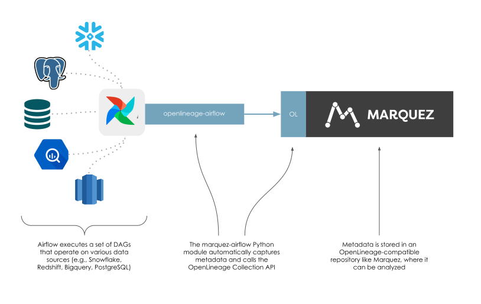

## What is Apache Airflow?

**Airflow** is a widely-used workflow automation and scheduling platform that can be used to author and manage data pipelines. Airflow uses workflows made of directed acyclic graphs (DAGs) of tasks. To learn more about Airflow, check out the Airflow [documentation](https://airflow.apache.org/docs/apache-airflow/stable/index.html).

## How does Airflow work with OpenLineage?

Understanding complex inter-DAG dependencies and providing up-to-date runtime visibility into DAG execution can be challenging. OpenLineage integrates with Airflow to collect DAG lineage metadata so that inter-DAG dependencies are easily maintained and viewable via a lineage graph, while also keeping a catalog of historical runs of DAGs.





The integration is implemented using the [openlineage-airflow](https://pypi.org/project/openlineage-airflow)  integration library, which sends OpenLineage events to [Marquez](https://marquezproject.ai). The DAG metadata collected can answer questions like:

* Why has a DAG failed?
* Why has the DAG runtime increased after a code change?
* What are the upstream dependencies of a DAG?


## How can I use this integration?

### Prerequisites

To use the OpenLineage Airflow integration, you'll need a running Airflow instance. You'll also need an OpenLineage compatible [HTTP backend](https://github.com/OpenLineage/OpenLineage#scope). In this guide, we'll be using the `openlineage-airflow` library to automatically send OpenLineage events to [Marquez](https://marquezproject.ai). 

### Configuration

Next, we'll need to specify where we want Airflow to send OpenLineage events. `openlineage-airflow` will use the `OPENLINEAGE_URL` environment variable to send OpenLineage events to Marquez. Optionally, we can also specify a namespace where the lineage events will be stored using the `OPENLINEAGE_NAMESPACE` environment variable.

For example, to send OpenLineage events to a local instance of Marquez with the `dev` namespace, use:

```bash
OPENLINEAGE_URL=http://localhost:5000
OPENLINEAGE_NAMESPACE="dev"
```

### Usage
#### Airflow 1.10+

First, download and install the latest `openlineage-airflow` library, by updating the `requirements.txt` file of your running Airflow instance with: 

```
openlineage-airflow
```

Then, to begin collecting Airflow DAG metadata with Marquez, make the following change to your DAG:

```diff
- from airflow import DAG
+ from openlineage.airflow import DAG
```

#### Airflow 2.0+
Set your LineageBackend in your [airflow.cfg](https://airflow.apache.org/docs/apache-airflow/stable/howto/set-config.html) or via environmental variable `AIRFLOW__LINEAGE__BACKEND` to
```
openlineage.lineage_backend.OpenLineageBackend
```
In contrast to integration via subclassing `DAG`, the `LineageBackend` based approach collects all metadata for task on each task completion.

### What to expect
When enabled, the library will:

* On DAG **start**, collect metadata for each task
* Collect task input / output metadata (source, schema, etc)
* Collect task run-level metadata (execution time, state, parameters, etc)
* On DAG **complete**, also mark the task as complete in Marquez

## Where can I learn more?

* Take a look at Marquez's Airflow [example](https://github.com/MarquezProject/marquez/tree/main/examples/airflow) to learn how to enable OpenLineage metadata collection for Airflow DAGs and troubleshoot failing DAGs using Marquez.
* Watch [Data Lineage with Apache Airflow](https://www.youtube.com/watch?v=dfRetdg9444)

## Feedback

What did you think of this guide? You can reach out to us on [slack](http://bit.ly/OpenLineageSlack) and leave us feedback!  


